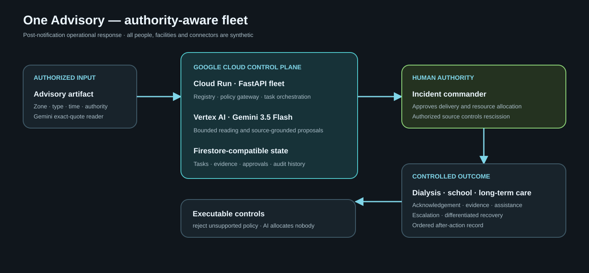
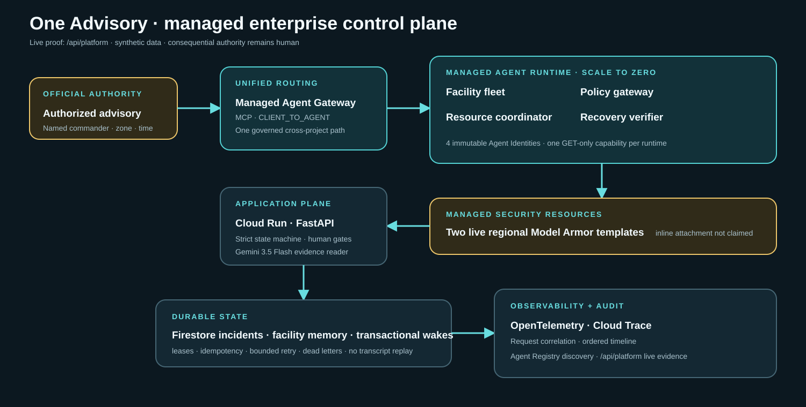

# One Advisory

> One warning. Three facility realities. One verified response.

One Advisory is an incident-command fleet that starts **after** an authorized drinking-water
advisory exists. It converts the same warning into source-grounded operational work for a dialysis
clinic, a school/childcare site, and a long-term-care facility; gathers evidence; escalates silence;
and verifies recovery after rescission.

**Hackathon track:** The Fortified Enterprise Fleet  
**Google model:** Gemini 3.5 Flash through Vertex AI / Google Gen AI SDK  
**Google Cloud:** Cloud Run package plus Firestore-compatible persistence  
**Data:** Every facility, person, message, advisory, resource, and approval is fictional.

## Live stack proof

The header's **Live stack** control reads `/health` and `/api/platform` at runtime. It turns green only when both the Cloud Run service and managed agent evidence plane verify live. Hover, click, or keyboard focus reveals the Google stack in use: Gemini 3.5 Flash on Vertex AI, Google Gen AI SDK, Cloud Run, Firestore, Cloud Scheduler, Cloud Trace, Agent Registry, Agent Runtime, Agent Identity, Agent Gateway, and Model Armor.

## Public operational sandbox

The public Cloud Run service is intentionally signup-free for hackathon evaluation and accepts fictional synthetic inputs only. It is no longer limited to one fixture: users can create multiple durable advisory exercises, supply a fictional authorized advisory and three critical-facility records, switch between incidents, and run each through the complete authority-gated response. `GET/POST /api/pilot/incidents` exposes the same capability as a typed API; `/api/pilot/readiness` states the boundary.

The deterministic sample remains one click away. Public global reset is disabled, new record IDs use the complete random UUID, internal scheduler workers remain OIDC-authenticated, and the customer UI contains no judge-only routes. Real operational data or connectors require a separately protected organization deployment; the public service is not an authorized emergency notification system.

## The distinction

Existing systems can define zones, identify customers, send alerts, record approvals, and publish
rescissions. One Advisory addresses the **last institutional mile**: did each critical facility
complete the different operational response the warning requires?

It does not issue public-health guidance, close facilities, allocate scarce resources, certify
compliance, or rescind an advisory. Named humans retain those authorities.

## Continuous demonstration

```text
authorized synthetic advisory
  -> three affected facility classes
  -> nine source-backed task proposals
  -> named human approval
  -> acknowledgements, evidence, assistance, non-response
  -> one scarce-resource conflict (AI chooses nobody)
  -> named human allocation
  -> authorized rescission
  -> three differentiated recovery checks
  -> closed, auditable response
```

The fleet also deliberately rejects a generic-autopilot proposal to “close every facility.” This
policy rejection is visible in the application and tested.

## Research boundary

- [CDC Drinking Water Advisory Communication Toolbox](https://www.cdc.gov/water-emergency/php/dwact/index.html): audience and planning structure.
- [CDC Water Use in Dialysis](https://www.cdc.gov/dialysis-safety/hcp/recommendations-resources/water-use-in-dialysis.html): dialysis-specific operational criticality.
- [CDC MMWR, Alabama water-system failure](https://www.cdc.gov/mmwr/preview/mmwrhtml/mm6006a1.htm): documented communication, alternative-water, institutional, and coordination gaps.
- [Hospital response to West Virginia water contamination](https://pmc.ncbi.nlm.nih.gov/articles/PMC5587347/): operational dependencies during water loss.
- [UOMS boil-water workflow](https://uoms.canopymapping.co/boil-water-notice-management-software): prior-art boundary for zone, notification, audit, approval, and rescission.

These sources justify the problem and shape the fixture. They do not validate this product or prove
that it prevents illness, reduces response time, or improves compliance.

## Architecture



| Layer | Running implementation |
|---|---|
| Interface | Responsive light/dark incident queue with custom synthetic intake and one-click sample |
| API | FastAPI with typed state transitions and conflict responses |
| Fleet | Eight registered roles with versions, scope, data class, and approval policy |
| Model | Gemini 3.5 Flash advisory reader with exact-quote verification; deterministic replay for tests |
| Persistence | Memory locally; Firestore adapter in Cloud mode |
| Control | Consequential actions and scarce-resource allocation require named humans |
| Evidence | Source-linked playbooks, facility evidence, policy rejection, ordered audit history |

Logical agents are modular application roles; this prototype does not claim one service or IAM
identity per role.

## Run and verify

```powershell
cd app
python -m pip install -r requirements.txt
python -m pytest -q
python scripts/check_a11y.py
python -m uvicorn service.main:app --host 127.0.0.1 --port 8000
python scripts/demo_flow.py --url http://127.0.0.1:8000
```

Open `/` for the product, `/api/pilot/readiness` for sandbox boundaries, `/api/proof` for executable safeguards, `/api/hardening/proof` for failure recovery, and `/docs` for OpenAPI.

Current local baseline on August 17, 2026:

- `95 passed`
- `13/13` HTTP acceptance checks
- `11/11` foundational proof and `8/8` adversarial hardening proof
- static accessibility result is recorded in [VALIDATION_EVIDENCE.md](VALIDATION_EVIDENCE.md)

## Gemini recording policy

`fixtures/advisory.recording.json` was produced by a live Vertex AI Gemini 3.5 Flash call on the
synthetic advisory and passed `5/5` adjacent truth checks. Replay remains the deterministic public
rehearsal path; the adjacent accuracy file is the measured model evidence.

```powershell
$env:GOOGLE_CLOUD_PROJECT="your-project"
python scripts/record_advisory.py --document web/advisory-fixture.png
```

## Deploy

```bash
cd app
export GOOGLE_CLOUD_PROJECT="your-project"
./deploy.sh
```

Deployment enables Firestore with `USE_FIRESTORE=true`. A release is not complete until the public
URL passes the same demo flow and a clean-browser review.

## Known limitations

- Three fictional facilities cannot establish general facility coverage.
- Playbooks require local-authority review and version governance.
- Notifications, facility systems, water logistics, and public-health systems are sandboxes.
- No field user, emergency manager, dialysis expert, or accessibility specialist has validated it.
- No health, speed, compliance, or economic outcome is claimed.

No source author, public agency, utility, facility, or prior-art vendor endorses One Advisory.

## August 16 hardening

One Advisory now includes transactional Firestore acknowledgement wakes, bounded retry/dead-letter behavior, Cloud Trace correlation, missing-source safe stops, failed-contact recovery that invents no acknowledgement, and an ambiguous-rescission authority gate. The API exposes both governance proof suites. All delivery and contact actions remain sandboxed.

## Findings and learnings

- Notification and verified facility response are different states; treating delivery as completion hides operational gaps.
- The same advisory needs different evidence by facility, while resource allocation remains a named command decision.
- Managed features matter when they narrow capability: four GET-only runtimes, four identities, one governed gateway, two live Model Armor templates, and no unsupported inline-enforcement claim.
- This proves routing, governance and failure behavior, not public-health outcomes or general facility coverage.

## Originality and reused-code disclosure

One Advisory's fleet, incident schema, UI, fixtures, managed capability mapping, evaluation, failure laboratory, research and submission materials were created for this contest-period submission. Generic clock, wake, observability, quarantine and verifier primitives were adapted from the entrant's Day Three contest-period production spine. They are disclosed in app/spine/__init__.py and independently tested here.

## Managed Agent Platform proof



The deployed /api/platform endpoint reads Google managed APIs live. It currently verifies four scale-to-zero Agent Runtime resources, four unique Agent Identities, binding to the shared governed client-to-agent MCP gateway, and two regional Model Armor templates. It fails explicitly if the evidence plane is unavailable; it does not substitute a checked-in claim. Firestore provides bounded cross-session incident and facility memory rather than raw transcript replay.

## Automated background execution

The deployed one-advisory-wake-scan Cloud Scheduler job calls the internal wake worker every minute with a Google-signed OIDC token from the dedicated agent-wake-scheduler service account. The application verifies audience, issuer, email and email verification before scanning. Unauthenticated calls return HTTP 401. The worker claims Firestore wakes transactionally, executes idempotent actions, bounds retries and retains dead letters. Reproduce or update the job with app/infra/provision_scheduler.ps1 after deployment.

